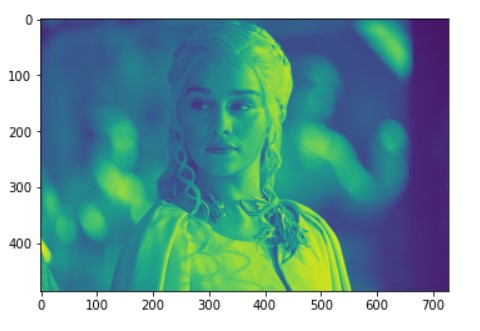
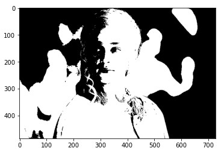
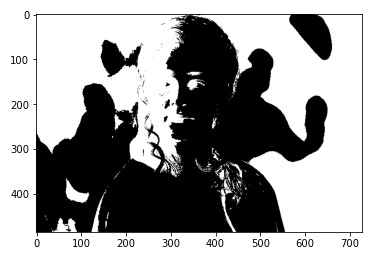
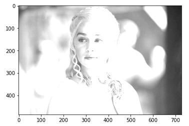
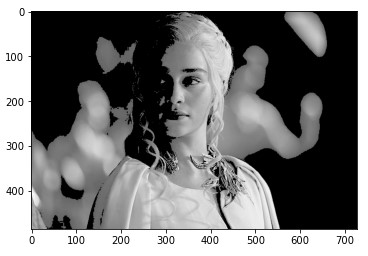
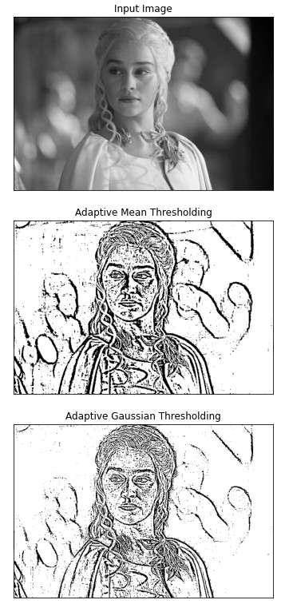
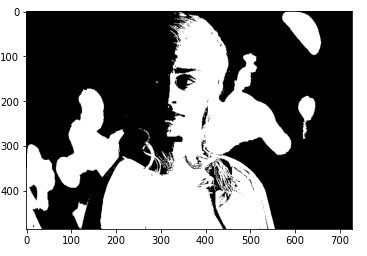

# Thresholding of Images
## Aim
To segment the image using global thresholding, adaptive thresholding and Otsu's thresholding using python and OpenCV.

## Software Required
1. Anaconda - Python 3.7
2. OpenCV

## Algorithm

### Step 1:
Load the image and convert the image to Grayscale.
<br>

### Step 2:
Smoothen the image using Gaussian Method.
<br>

### Step 3:
Apply the reqiured algorithms for Global thresholding.
<br>

### Step 4:
Apply the reqiured algorithms for Adaptive thresholding.
<br>

### Step 5:
Apply the reqiured algorithms for Otsu's thresholding.
<br>

## Program

```python
# Load the necessary packages
import cv2
import matplotlib.pyplot as plt
# Read the Image and convert to grayscale
BGR_image=cv2.imread('wanda.jpg')
gray=cv2.cvtColor(BGR_image,cv2.COLOR_BGR2GRAY)
plt.imshow(gray)
# Use Global thresholding to segment the image
ret,thresh1=cv2.threshold(gray,100,255,cv2.THRESH_BINARY )
ret,thresh2=cv2.threshold(gray,100,255,cv2.THRESH_BINARY_INV)
ret,thresh3=cv2.threshold(gray,100,255,cv2.THRESH_TRUNC)
ret,thresh4=cv2.threshold(gray,100,255,cv2.THRESH_TOZERO)
ret,thresh5=cv2.threshold(gray,100,255,cv2.THRESH_TOZERO_INV)
# Use Adaptive thresholding to segment the image
img= cv2.GaussianBlur(gray,(3,3),0)
th1 = cv2.adaptiveThreshold(gray, 255, cv2.ADAPTIVE_THRESH_MEAN_C,cv2.THRESH_BINARY, 11,2) 
th2= cv2.adaptiveThreshold(gray, 255, cv2.ADAPTIVE_THRESH_GAUSSIAN_C,cv2.THRESH_BINARY, 11,2)
plt.imshow(img,cmap='gray')
plt.title('Input Image'), plt.xticks([]), plt.yticks([])
plt.show()
plt.imshow(th1,cmap='gray')
plt.title('Adaptive Mean Thresholding'), plt.xticks([]), plt.yticks([])
plt.show()
plt.imshow(th2,cmap='gray')
plt.title('Adaptive Gaussian Thresholding'), plt.xticks([]), plt.yticks([])
plt.show()

# Use Otsu's method to segment the image 
ret2,th2 = cv2.threshold(gray,0,255,cv2.THRESH_BINARY+cv2.THRESH_OTSU)
# Display the results
plt.imshow(thresh1,cmap='gray')
plt.imshow(thresh2,cmap='gray')
plt.imshow(thresh3,cmap='gray')
plt.imshow(thresh4,cmap='gray')
plt.imshow(thresh5,cmap='gray')
plt.imshow(th2,cmap='gray')
```
## Output:
<br>

### Original Image:
<br>


<br>
<br>
<br>
<br>
<br>

### Global Thresholding:
<br>


<br>


<br>


<br>


<br>


<br>

<br>
<br>
<br>
<br>
<br>

### Adaptive Thresholding:
<br>


<br>
<br>
<br>
<br>
<br>

### Optimum Global Thesholding using Otsu's Method:
<br>


<br>
<br>
<br>
<br>
<br>


## Result
Thus the images are segmented using global thresholding, adaptive thresholding and optimum global thresholding using python and OpenCV.

